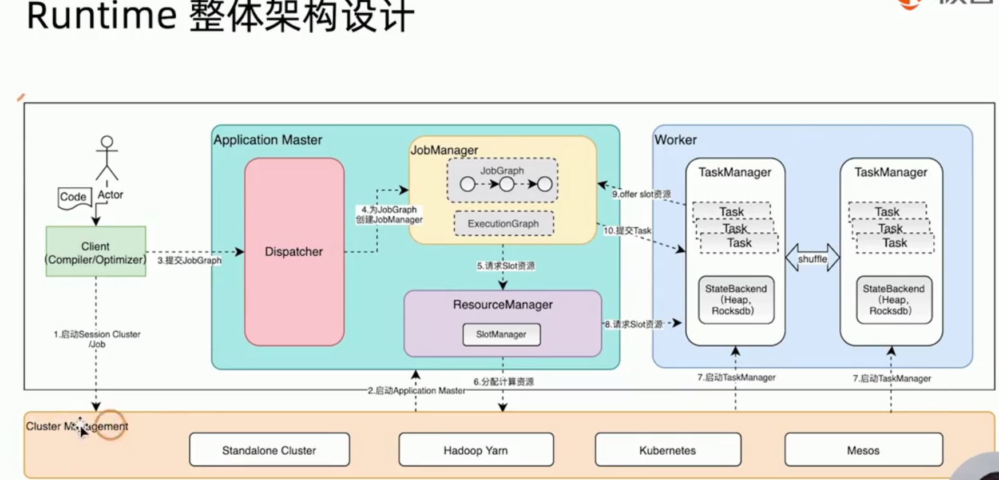
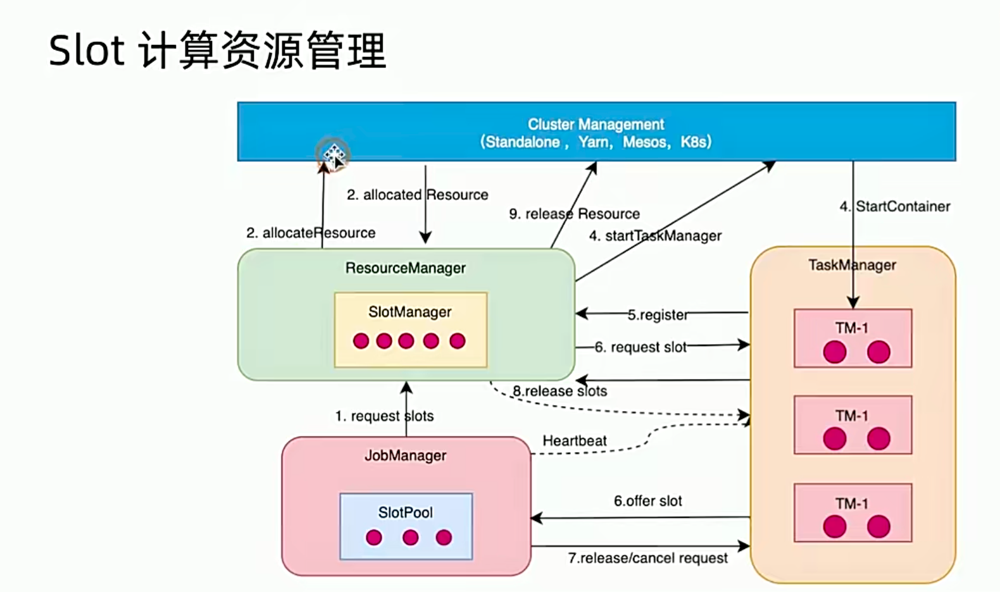

二分查找

二分查找是在数组nums的某个范围内进行的，初始范围包括整个数组。每次二分查找都选取位于当前查找范围中间的下标为mid的值，然后比较nums[mid]和目标值t。如果nums[mid]大于或等于t，那么接着比较它的前一个数字nums[mid-1]和t。如果同时满足nums[mid]≥t并且nums[mid-1]＜t，那么mid就是符合条件的位置，返回mid即可。如果nums[mid]≥t并且nums[mid-1]≥t，那么符合条件的位置一定位于mid的前面，接下来在当前范围的前半部分查找。如果nums[mid]小于t，则意味着符合条件的位置一定位于mid的后面，接下来在当前范围的后半部分查找。有两种情况需要特别注意。第1种情况是当mid等于0时如果nums[mid]依然大于目标值t，则意味着数组中的所有数字都比目标值大，应该返回0。第2种情况是当数组中不存在大于或等于目标值t的数字时，那么t应该添加到数组所有值的后面，即返回数组的长度

```java
/**
 * @ClassName BinSearch
 * @Author cui
 * @Date 2025/1/27 12:25
 **/
public class BinSearch {

    public int binSearch(int[] arr, int target) {
        int left = 0;
        int right = arr.length - 1;

        while (left <= right) {
            int mid = (left + right) / 2;
            if (arr[mid] >= target) {
                if (mid == 0 || arr[mid - 1] < target) {
                    return mid;
                }
                right = mid - 1;
            } else {
                left = mid + 1;
            }
        }
        return arr.length;
    }


    public static void main(String[] args) {
        int[] arr={1,3,6,7,9};
        BinSearch binSearch = new BinSearch();
        System.out.println(binSearch.binSearch(arr,10));
    }

}
```

爬楼梯
```java
/**
 * @ClassName ClimbStair
 * @Author cui
 * @Date 2025/1/31 10:03
 **/
public class ClimbStair {

    /**
     * 递归函数的模板
     * f() {
     *     1.终止条件
     *     2.f(i)=f(i-1) + f(i-2) + x
     * }
     */
    public int helper(int[] cost, int i) {
        /**
         * f(i)= min(f(i-1)+f(i-2)) + cost[i]
         */
        if (i < 2) {
            return cost[i];
        }
        return Math.min(helper(cost, i - 1), helper(cost, i - 2)) + cost[i];
    }

    public int climb(int[] cost) {
        int length = cost.length;
        return Math.min(helper(cost, length - 2), helper(cost, length - 1));
    }

    public static void main(String[] args) {
        int[] cost = {1, 100, 3, 1, 100};
        System.out.println(new ClimbStair().climb(cost));
    }

}
```
# flink statebackend
## 按存储介质分
- 1.memory 
- 2.file 
- 3.分布式存储，rocksDB

## 按使用场景划分
- 1.operator statebackend，绑定到算子实例上的状态，每个算子子任务（并行实例）维护自己的状态，与输入数据的键无关。
    - 使用场景：常用于 Source 和 Sink 等算子，在这些场景中，状态与算子的整体处理逻辑相关，而不是与特定的键相关。例如，在 Kafka 连接器中，每个 Kafka 分区对应的 Source 任务需要记录其在分区中的消费偏移量，这些偏移量就是 Operator State。

- 2.keyed statebackend,每个键都有自己独立的状态。Keyed State Backend 用于管理和存储这些按键划分的状态
    - 使用场景：适用于需要对不同键的数据进行独立处理和统计的场景，例如实时计算每个用户的消费总额、统计每个商品的销量等。在这些场景中，状态是与具体的键相关联的，不同的键可以有不同的状态值。

# flink runtime

flink作业启动的流程，以flink on yarn为例
1. client将用户代码编译成stream graph
2. 提交到yarn，分配application master
3. 



## slot资源怎么配置
在 flink 中，slot 是 TaskManager 中的资源单元，用于执行任务的并行实例。每个 TaskManager 可以包含多个 Slot，而每个 Slot 可以运行一个或多个任务的子任务。合理配置 Slot 资源可以提高集群的资源利用率和作业的性能。
__在flink 1.14之前，无法直接指定slot的内存和cpu，需要指定TaskManager的资源，然后TaskManager/numberOfTaskSlots，便可得出slot的配置，比如__
设定
```xml
# TaskManager 启动时分配的 Task Slots 数量
taskmanager.numberOfTaskSlots: 4   # 每个 TaskManager 提供 4 个任务槽
# 每个 TaskManager 分配的 CPU 核心数
taskmanager.cpu.cores: 4           # 每个 TaskManager 使用 4 个 CPU 核心
taskmanager.memory.process.size: 4g
```
那么slot的cpu为1c,process memory为1g
__从 Flink 1.14 开始，支持为 Slot 配置具体的资源（CPU 和内存）。可以通过以下参数配置：__
```xml
# 配置每个 Slot 的 CPU 资源
taskmanager.cpus: 2

# 配置每个 Slot 的内存资源
taskmanager.memory.task.heap.size: 2048m  # 堆内存
taskmanager.memory.task.off-heap.size: 1024m  # 堆外内存
taskmanager.memory.managed.size: 1024m  # 托管内存
```

## dispatcher作用
Dispatcher 的核心功能

- 接收并管理作业提交
    作业提交入口：Dispatcher 是客户端提交作业（flink run）的接收端，处理用户通过 REST API 或命令行提交的作业。
    作业队列管理：在 Flink 的会话模式（Session Mode）下，Dispatcher 可以管理多个作业的提交队列，依次调度执行。

1.2 启动 JobMaster
JobMaster 创建：当作业提交后，Dispatcher 负责为该作业创建一个 JobMaster 实例。JobMaster 是单个作业的执行控制器，负责协调 TaskManager、Checkpoint 等作业级操作。

作业生命周期管理：Dispatcher 监控作业的执行状态（如启动、完成、失败），并在作业完成后清理相关资源。

1.3 提供 REST 服务
REST API 端点：Dispatcher 暴露 REST 接口（默认端口 8081），用于查询集群状态、提交作业、取消作业等操作。

示例：通过 http://<jobmanager-host>:8081/jobs 可以查看当前运行的作业列表。