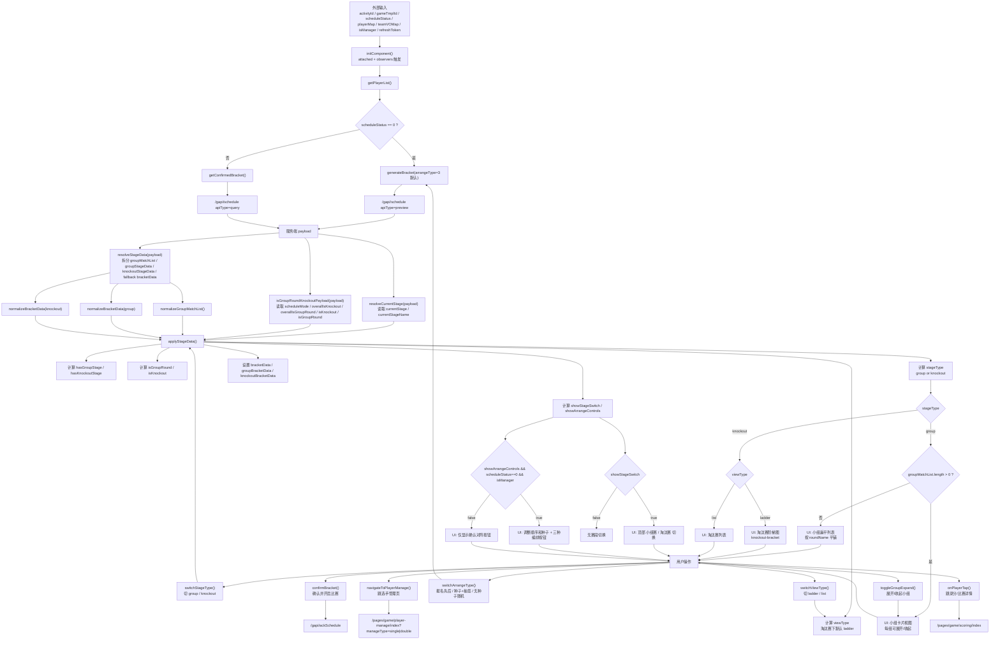

# game-preview 预览流程分析

## 1. 背景与结论

`src/components/game-preview` 是比赛预览的统一展示组件，当前承接了普通比赛的对阵预览与已编排回显。它不是按“一个赛制对应一个页面”实现的，而是先把服务端返回的数据拆成“小组赛数据”和“淘汰赛数据”，再根据阶段和视图状态落到不同的 UI 分支。

从业务赛制看，当前可以归纳为 3 类预览：

1. 纯淘汰赛
2. 纯小组赛
3. 小组赛 + 淘汰赛

从实际渲染分支看，当前共有 4 种 UI 形态：

1. 淘汰赛阶梯图
2. 淘汰赛列表
3. 小组卡片视图
4. 小组扁平列表

核心结论：

- 业务上是 3 类赛制，渲染上是 4 个分支。
- `currentStage/currentStageName` 负责表达“当前处于哪个阶段”。
- `overallIsKnockout/overallIsGroupRound` 负责表达“整体赛制是否包含某阶段”。
- `hasKnockoutStage/hasGroupStage` 是前端基于当前 payload 归一化后的本地状态，不等同于服务端原始字段。
- `stageType` 决定当前看小组赛还是淘汰赛，`viewType` 决定淘汰赛是阶梯图还是列表。

## 2. 主流程

下面这张流程图按“数据字段 -> 判定函数 -> UI 分支 -> 用户操作”的顺序梳理了组件主链路。

## 3. 关键状态与字段说明

### 3.1 服务端输入字段

#### `currentStage`

- 来源：服务端 payload
- 语义：当前阶段类型，常见值为 `GROUP_ROUND` 或 `KNOCKOUT`
- 作用：参与 `resolveCurrentStage()`，决定当前默认落在哪个赛段

#### `currentStageName`

- 来源：服务端 payload
- 语义：当前阶段中文名，常见值为“小组赛”或“淘汰赛”
- 作用：和 `currentStage` 一起参与阶段识别，兼容服务端未返回英文枚举时的场景

#### `scheduleMode`

- 来源：服务端 payload
- 语义：整体赛制模式，例如 `GROUP_ROUND_KNOCKOUT`
- 作用：参与 `isGroupRoundKnockoutPayload()`，用于识别是否为“小组赛 + 淘汰赛”混合赛制

#### `overallIsKnockout`

- 来源：服务端 payload
- 语义：整体赛制是否包含淘汰赛阶段
- 当前前端作用：
  - 参与 `isGroupRoundKnockoutPayload()` 判断混合赛制
  - 参与推导 `isGroupRound`
  - 直接控制 `showArrangeControls`

#### `overallIsGroupRound`

- 来源：服务端 payload
- 语义：整体赛制是否包含小组赛阶段
- 当前前端作用：
  - 参与 `isGroupRoundKnockoutPayload()` 判断混合赛制
  - 参与推导 `isGroupRound`

#### `isKnockout`

- 来源：服务端 payload
- 语义：当前代码里被当作“是否纯淘汰赛”的推导基础或兜底值使用
- 作用：
  - 在服务端未返回 `overallIsKnockout` 时，作为兜底值参与阶段推断
  - 影响底部确认按钮文案

#### `isGroupRound`

- 来源：服务端 payload
- 语义：当前代码里被当作“小组赛相关布尔”的兜底值使用
- 作用：
  - 在服务端未返回 `overallIsGroupRound` 时，作为兜底值参与阶段推断

### 3.2 前端本地归一化状态

#### `hasGroupStage`

- 来源：前端在 `applyStageData()` 中根据 `groupMatchList` 和 `groupBracketData` 计算
- 语义：当前 payload 中是否已经成功整理出可展示的小组赛数据
- 影响：
  - 决定是否允许切到小组赛
  - 决定 `stageType` 的兜底值

#### `hasKnockoutStage`

- 来源：前端在 `applyStageData()` 中根据 `knockoutBracketData` 计算
- 语义：当前 payload 中是否已经成功整理出可展示的淘汰赛数据
- 影响：
  - 决定是否允许切到淘汰赛
  - 决定是否显示“阶梯 | 列表”切换
  - 决定 `stageType` 的兜底值

#### `stageType`

- 来源：`applyStageData()` 结合服务端当前阶段、本地已有状态和兜底规则计算
- 可选值：`group` / `knockout`
- 作用：决定当前使用小组赛渲染分支还是淘汰赛渲染分支

#### `viewType`

- 来源：`applyStageData()` 与 `switchViewType()`
- 可选值：`ladder` / `list`
- 作用：只在淘汰赛场景下生效，决定淘汰赛显示为阶梯图还是列表

#### `showStageSwitch`

- 来源：`applyStageData()`
- 语义：是否显示“小组赛 / 淘汰赛”切换
- 当前规则：只有识别为混合赛制且存在对应阶段数据时才显示

#### `showArrangeControls`

- 来源：`applyStageData()`
- 当前规则：直接等于 `overallIsKnockout`
- 作用：
  - 控制“调整顺序和种子”入口是否显示
  - 控制三种编排方式按钮是否显示

### 3.3 中间推导状态

#### `isGroupRound`

- 来源：`applyStageData()`
- 当前规则：
  - 如果是混合赛制，直接认为 `isGroupRound = true`
  - 否则使用 `overallIsGroupRound && !overallIsKnockout`
- 作用：辅助判断是否属于小组赛语义

#### `isKnockout`

- 来源：`applyStageData()`
- 当前规则：`overallIsKnockout && !isGroupRound`
- 作用：
  - 用于底部确认按钮文案
  - 表示“当前前端语义上是否视作纯淘汰赛”

## 4. 三种预览形态拆解

### 4.1 纯淘汰赛

#### 如何判定

- `hasKnockoutStage = true`
- `hasGroupStage = false`
- `showStageSwitch = false`
- `stageType` 最终落到 `knockout`

#### 为什么有“阶梯 / 列表”

顶部“阶梯 | 列表”切换的条件是：

- `stageType === 'knockout'`
- `hasKnockoutStage === true`

因此纯淘汰赛天然支持两种视图。

#### 为什么会显示“调整顺序和种子”

当前实现中，`showArrangeControls = overallIsKnockout`。只要整体赛制包含淘汰赛阶段，且当前是管理员、比赛还未确认编排，就会显示：

- “调整顺序和种子”
- “报名先后”
- “种子+抽签”
- “无种子随机”

### 4.2 纯小组赛

#### 如何判定

- `hasGroupStage = true`
- `hasKnockoutStage = false`
- `showStageSwitch = false`
- `stageType` 最终落到 `group`

#### 为什么只有列表

纯小组赛不会进入淘汰赛分支，因此：

- 不显示“阶梯 | 列表”
- 只走小组赛容器

#### `groupMatchList` 和 `bracketData` 的两种落法

小组赛在页面上有两种具体渲染：

1. `groupMatchList.length > 0`
   - 走小组卡片视图
   - 每个小组可展开/收起
   - 组内再按轮次展示比赛

2. `groupMatchList.length === 0`
   - 回退到扁平列表
   - 直接按 `bracketData` 的轮次顺序展示

因此“纯小组赛”虽然业务上只有一种，但 UI 上会落成 2 个分支。

### 4.3 小组赛 + 淘汰赛

#### 如何判定混合赛制

当前通过 `isGroupRoundKnockoutPayload()` 判断，主要依据：

1. `scheduleMode === 'GROUP_ROUND_KNOCKOUT'`
2. 或同时满足 `overallIsGroupRound && overallIsKnockout`

#### 为什么会出现“小组赛 / 淘汰赛”切换

当组件识别为混合赛制，且至少存在一端数据时，会设置：

- `showStageSwitch = true`

此时页面顶部出现“小组赛 / 淘汰赛”切换。

#### `currentStage` 与手动切换的关系

`currentStage/currentStageName` 决定首次或服务端主导时默认进入哪个阶段。

前端切换后：

- `switchStageType('group')` 会把 `bracketData` 切到 `groupBracketData`
- `switchStageType('knockout')` 会把 `bracketData` 切到 `knockoutBracketData`

因此当前阶段有两层含义：

1. 服务端告诉前端“现在比赛处于哪个阶段”
2. 前端允许用户在页面上切换查看不同阶段的数据

## 5. 用户操作映射

### `switchStageType`

- 入口：顶部“小组赛 / 淘汰赛”切换
- 修改状态：
  - `stageType`
  - `bracketData`
  - 在切到淘汰赛且没有视图状态时，补 `viewType='ladder'`

### `switchViewType`

- 入口：顶部“阶梯 / 列表”切换
- 修改状态：
  - `viewType`

### `toggleGroupExpand`

- 入口：小组卡片头部
- 修改状态：
  - `groupMatchList[index].expanded`

### `switchArrangeType`

- 入口：底部三种编排方式按钮
- 行为：
  - 未确认编排时重新生成预览
  - Mock 模式下本地切换数据
  - 真实数据下重新调 `generateBracket()`

### `confirmBracket`

- 入口：底部确认按钮
- 行为：
  - 调 `/gapi/ackSchedule`
  - 成功后跳转回比赛页

### `navigateToPlayerManage`

- 入口：底部“调整顺序和种子”
- 行为：
  - 根据当前对阵识别单打/双打
  - 跳转到 `/pages/game/player-manage/index?manageType=single|double`

### `onPlayerTap`

- 入口：比赛行中的选手/队伍单元格
- 行为：
  - 跳转到录分或比赛详情相关页面

## 6. 代码索引

### 6.1 关键文件

- `src/components/game-preview/index.js`
- `src/components/game-preview/index.wxml`

### 6.2 初始化与数据入口

- `initComponent()`
- `getPlayerList()`
- `generateBracket()`
- `getConfirmedBracket()`

### 6.3 判定函数

- `resolveCurrentStage()`
- `isGroupRoundKnockoutPayload()`
- `resolveStageData()`
- `applyStageData()`

### 6.4 小组赛数据整理

- `normalizeGroupMatchList()`
- `flattenGroupMatchList()`
- `buildGroupProgress()`

### 6.5 渲染分支

- 顶部“阶梯 | 列表”切换
- 顶部“小组赛 / 淘汰赛”切换
- 淘汰赛阶梯图
- 小组卡片视图
- 小组扁平列表
- 淘汰赛列表
- 底部操作栏

### 6.6 交互函数

- `switchStageType()`
- `switchViewType()`
- `toggleGroupExpand()`
- `switchArrangeType()`
- `confirmBracket()`
- `navigateToPlayerManage()`
- `onPlayerTap()`

## 7. 代码阅读建议

如果要快速理解当前实现，建议按下面顺序阅读：

1. 先看 `initComponent()`，理解数据从哪里来
2. 再看 `resolveCurrentStage()` 和 `isGroupRoundKnockoutPayload()`，理解阶段判定
3. 再看 `resolveStageData()` 和 `applyStageData()`，理解数据如何被整理成页面状态
4. 最后对照 `index.wxml` 的 4 个渲染分支看模板

这样能最快把“3 类业务预览”和“4 个实际渲染分支”对应起来。
