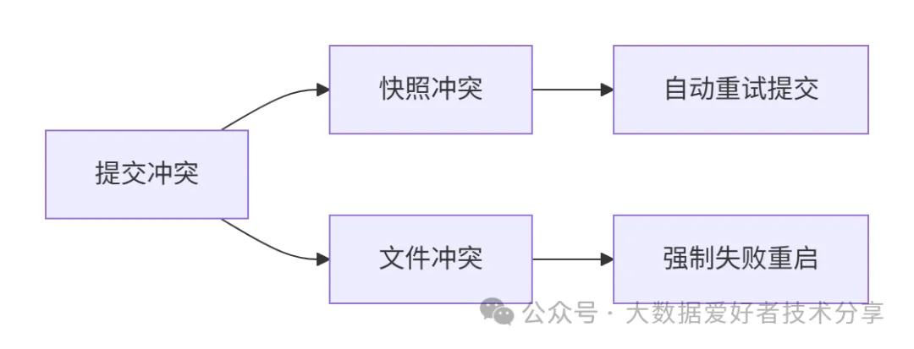
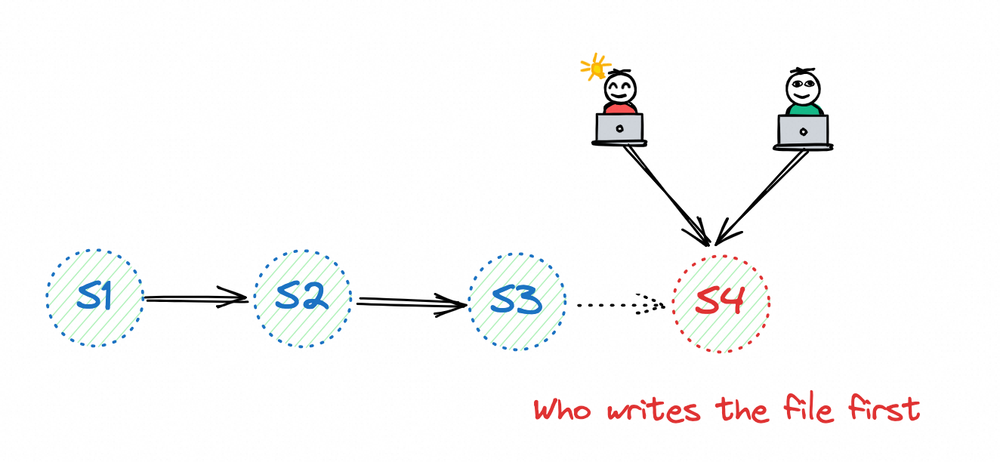
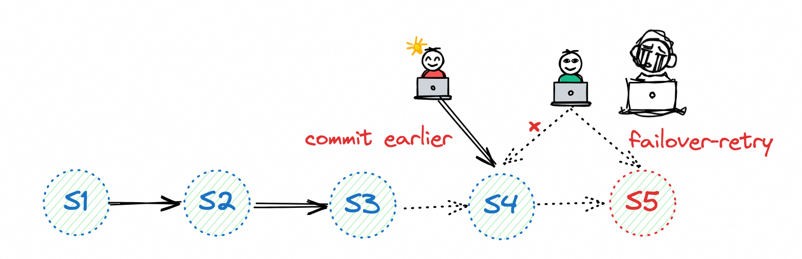

# 多并发写入：乐观锁与冲突解决机制
Paimon采用<mark>乐观并发控制实现多任务并发写入</mark>，每个任务独立生成数据快照，提交时通过增量文件（添加/删除文件）更新状态。

# 冲突场景与解决方案：

## 快照冲突
当快照ID被其他任务抢占时，Paimon利用文件系统原子重命名机制解决：
- HDFS：原生支持事务性重命名
- 对象存储（OSS/S3）：需启用lock.enabled选项配合Hive/JDBC Metastore

## 文件冲突
逻辑删除文件时检测到其他任务已删除相同文件：
- 立即触发Failover重启
- 重启后从文件系统获取最新状态
- 保障零数据丢失/重复

