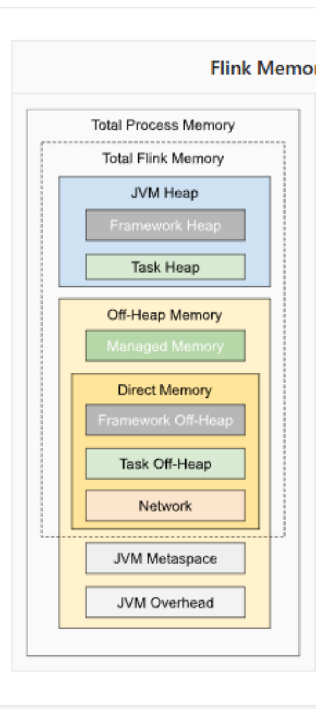

# slot资源怎么配置
在 flink 中，slot 是 TaskManager 中的资源单元，用于执行任务的并行实例。每个 TaskManager 可以包含多个 Slot，而每个 Slot 可以运行一个或多个任务的子任务。合理配置 Slot 资源可以提高集群的资源利用率和作业的性能。
1. 在flink 1.14之前，无法直接指定slot的内存和cpu，需要指定TaskManager的资源，然后TaskManager/numberOfTaskSlots，便可得出slot的配置，比如
设定
```java
# TaskManager 启动时分配的 Task Slots 数量
taskmanager.numberOfTaskSlots: 4 # 每个 TaskManager 提供 4 个任务槽
# 每个 TaskManager 分配的 CPU 核心数
taskmanager.cpu.cores: 4 # 每个 TaskManager 使用 4 个 CPU 核心
taskmanager.memory.process.size: 4g
```
那么slot的cpu为1c,process memory为1g
2. 从 Flink 1.14 开始，支持为 Slot 配置具体的资源（CPU 和内存）。可以通过以下参数配置
```java
# 配置每个 Slot 的 CPU 资源
taskmanager.cpus: 2

# 配置每个 Slot 的内存资源
taskmanager.memory.task.heap.size: 2048m # 堆内存
taskmanager.memory.task.off-heap.size: 1024m # 堆外内存
taskmanager.memory.managed.size: 1024m # 托管内存
```

# Dispatcher 的核心功能
1. 接收并管理作业提交
作业提交入口：Dispatcher 是客户端提交作业（flink run）的接收端，处理用户通过 REST API 或命令行提交的作业。
作业队列管理：在 Flink 的会话模式（Session Mode）下，Dispatcher 可以管理多个作业的提交队列，依次调度执行。
2. 启动 JobMaster
JobMaster 创建：当作业提交后，Dispatcher 负责为该作业创建一个 JobMaster 实例。JobMaster 是单个作业的执行控制器，负责协调 TaskManager、Checkpoint 等作业级操作。
作业生命周期管理：Dispatcher 监控作业的执行状态（如启动、完成、失败），并在作业完成后清理相关资源。

3. 提供 REST 服务
REST API 端点：Dispatcher 暴露 REST 接口（默认端口 8081），用于查询集群状态、提交作业、取消作业等操作。

# 介绍体验数仓
先说业务，我对接的业务方是服务体验的运营，业务目标是降低客诉量，提高用户满意度
1.数据来源是c端用户、商家、骑手的客诉进线，包括APP内进线、电话语音
2.数仓分层是参照经典的五层架构ods，dwd、dwm,dws,app
核心维度是客诉问题分类，核心指标是nps满意度评分，人工服务量


客诉进线内容进行分类，拆成mece的问题树，这些问题就是核心维度
然后拆解出人工服务量，除上订单量，产出万订单人工服务量，这个是核心指标

然后分析各问题下的人工服务量，针对问题进行治理

# 介绍投放业务
首先对齐投放的概念，抖音上看到短剧的精彩片段，点击视频链接会跳转到app下载，或者打开短剧app
这个流程涉及哪几个角色呢？
1.投放优化师，负责剪辑素材，在广告平台，比如抖音巨量、腾讯广点通、海外的Facebook等创建广告计划，上传素材，出价
2.广告平台回传投放计划对应的广告消耗

数据是怎么做工的呢
1.投放归因，将广告点击和用户购买会员的订单事件归因，实时计算投放计划的roi,及时通知优化师增加或者减少广告账户预算
2.制定投放标准，根据同品类短剧的roi制定投放标准，比如女频、长篇、抖音平台的day1 roi应该达到30%，指导优化师投放
3.计算优化师绩效，根据roi、充值金额计算优化师该分多少钱
4.财务结算，短剧有第三方制作，需要根据播放量，给短剧制作者分成
5.内容供给，分析各品类短剧的roi，播放量，留存率等调整内容引进策略

投放归因逻辑
数据源：广告点击事件，充值事件
三个事件做union，source端遇到充值事件则生成一个watermark，按照uid做keyby，开窗，窗口大小30min
在窗口中排序，将充值事件归属到广告点击上


# 怎么衡量一个数仓建设的好不好
完善度、复用度、规范度三个角度去评估
可以从平台任务血缘和ad-hoc查询日志入手
统计以下指标
完善度可以用两个指标进行衡量，跨层引用率（比如dwd不全，则被迫要查ods，可得计算公式为：ODS层直接被DWM/DWS/ADS/DM层引用的表，占所有ODS层表（仅统计活跃表）比例。）、汇总层数据查询占总查询的比例（dwm,dws）

复用度可以统计dwd/dwm/dws的应用系数（即一个表被下游几个任务所使用）

# 数仓为什么要分层
1. 维护成本降低。试想一个上千行的代码从头一点点理解，有问题需要修改时的维护成本是相当高的，而且很容易出错。
2. 隔离变化。试想一下，如果某天需要更换数据源A为C，只需要修改任务1的代码即可，对下游的可以做到屏蔽变化，无感知。
3. 增加了复用性，进而带来一致性的提升和开发效率的提升
4. 分层后可以持久化，可以用空间换时间，节省计算资源
5. 统一建设思路，方便分工

# 数仓分几层
1. 数据源层：ODS（Operational Data Store）
ODS 层，是最接近数据源中数据的一层，为了考虑后续可能需要追溯数据问题，因此对于这一层就不建议做过多的数据清洗工作，原封不动地接入原始数据即可，至于数据的去噪、去重、异常值处理等过程可以放在后面的 DWD 层来做。
2. 数据明细层：DWD（Data Warehouse Detail）
该层一般保持和 ODS 层一样的数据粒度，并且提供一定的数据质量保证。DWD 层要做的就是将数据清理、整合、规范化、脏数据、垃圾数据、规范不一致的、状态定义不一致的、命名不规范的数据都会被处理。
同时，为了提高数据明细层的易用性，该层会采用一些维度退化手法，将维度退化至事实表中，减少事实表和维表的关联。
3. 数据中间层：DWM（Data WareHouse Middle）
轻度聚合操作，生成一系列的中间表，提升公共指标的复用性，减少重复加工。
直观来讲，就是对通用的核心维度指标进行加工，算出通用指标。（比如对于订单状态表（商家信息表，券信息表，活动信息表），基本所有分析方向都会用到，补贴有商补、美补等，计算口径复杂，但是其他业务方向在用补贴数据时，可能只想用一个最终数值，比如总补贴金额，如果各业务方向都自己从dwd读取，自己做处理，非常麻烦且易出错）
如果业务相对简单，dws可以直接引用dwd
4. 数据服务层：DWS（Data WareHouse Servce）
主题宽表


# 怎么进行数仓建模
1. 业务目标对齐
明确业务场景（分析客诉量波动，优化配送规则，（比如骑手对哪些规则违规率比较高，可以适当放宽），发现经营风险（比如食品安全订单，及时发现问题，避免造成舆论事件））

梳理核心指标（如客诉量、万订单人工服务量）和业务分析维度（客诉问题分类，用户现象、诉求分类等）

2. 数据源调研
梳理数据来源（业务数据库、日志、第三方API）
评估数据质量（完整性、一致性、更新频率）

3. 建模方法论选择

# 什么是维度
维度在数据仓库中的作用是为事实数据提供上下文信息。不同类型的维度用于解决不同的业务场景和数据建模需求。常见的维度类型包括：
按照变与不变，可分为
- 标准维度：描述基本的业务数据，如时间、产品、客户等。
- 慢变维度：处理随时间变化的维度数据。

# 事实表分哪几类
- 事务型事实表：记录业务事件的详细数据，适合实时的事件跟踪和分析。比如订单明细表
- 周期型事实表：记录周期性数据的快照，适合按时间段进行汇总分析。比如财务月报
- 累积型事实表：记录某一时间点前的累积数据，适合查看累计结果。比如客户累计观看时长，消费金额
- 聚合型事实表：记录汇总的度量数据，适合提高查询性能，减少大规模数据查询的复杂度。比如各业务线客诉量

## 为什么要分这些类型的事实表？
- 满足不同的业务需求：

每种类型的事实表都针对特定的业务需求。例如，事务型事实表适合详细跟踪每个事件，周期型事实表适合进行定期快照，累积型事实表适合累积计算，派生型事实表适合跟踪事件的发生情况，聚合型事实表适合提高查询性能。

1. 优化查询性能：

聚合型事实表和周期型事实表能够通过预先汇总和定期快照，减少对原始数据的查询负担，提高数据处理和查询的效率。

2. 数据管理与存储：

通过将不同类型的事实表分开管理，可以对数据进行有效的组织和存储。例如，累积型和聚合型事实表往往比事务型事实表更小，这样可以减少存储空间的使用，并提高查询效率。

3. 满足分析需求：

分类事实表使得不同类型的分析变得更加容易。例如，对于销售数据的深度分析，可能需要事务型事实表；而对于查看某个时间段的整体销售表现，则更适合周期型或聚合型事实表。

4. 历史数据的管理：

慢变维度和累积型事实表通常需要保留历史数据，通过专门的表类型，可以更好地处理这些数据的演变和变化。

## 维度设计要点
维度表构建需要注意两点
1. 一致性（Conformed Dimension）：确保跨业务线统一（如业务线的枚举值）
2. 缓慢变化维（SCD）处理：
    - Type1：覆盖历史值（适用于修正错误）
    - Type2：新增版本记录（常用，保留历史轨迹）
    - Type3：添加历史字段（有限历史存储）


## 退化维度
将高频访问的小维度（如订单号）直接嵌入事实表减少关联


# 怎么理解rdd
rdd全称resilent distributed datasets，翻译过来就是弹性分布式数据集
可以从三个特性上理解
1. partition rdd是分布式的，数据在物理上散落在不同计算节点的内存或是磁盘中
2. dependencies 在spark 中，任何一个rdd都不是凭空产生的，每个rdd都是基于某种计算逻辑从某个数据源转换而来。rdd dependencies属性封装了rdd所需的数据源，术语叫做父依赖（或父rdd）
3. compute方法则封装了从父rdd到当前rdd的转换逻辑
由dependencies和compute属性提供的容错能力，为spark分布式内存计算的稳定性提供了坚实基础，不同的rdd通过dependencies和compute串联起来

taskmanager内存管理

taskmanager是一个jvm进程，内存分堆内、堆外
- 堆内
堆内又分为task.heap和framework heap，其中
    - task heap
        用于存储任务执行过程中的对象（如用户代码创建的对象、Flink 运行时对象）。
        通过taskmanager.memory.task.heap.size 配置堆内存大小。
    - framework heap
        Flink 框架本身使用的堆内存（如 Akka RPC）    
        通过taskmanager.memory.framework.heap.size 配置大小


- 堆外内存
堆外内存可分为managed memory（托管内存）和direct memory(直接内存)
    - network buffer
        用于taskmanager之间数据传输
        通过taskmanager.memory.network.fraction调整

    - direct memory
        其中direct可分为offheap和network buffer

offheap包括
task off-heap
用于网络缓冲、排序、RocksDB 状态后端等 taskmanager.memory.task.off-heap.size

framework off-heap
Flink 框架本身使用的堆外内存   
taskmanager.memory.framework.off-heap.size


## 怎么理解direct
在进行网络传输时，如果使用 Java 堆内存，数据需要从 Java 堆复制到内核空间的缓冲区，然后再发送到网络。
而使用直接内存，数据可以直接从直接内存发送到网络，避免了一次拷贝操作，提高了性能。
这也是 “Direct” 所体现的直接性，即直接进行数据的读写操作，减少不必要的中间环节。

# dws层怎么应对频繁增加的维度
宽表设计的本质是通过冗余维度数据提升查询性能，但新增维度可能引发以下问题：
- 粒度变化
新增维度可能改变表的粒度（如从订单级细化到用户级别），需重新ETL全量数据。
- 下游影响
修改DWS层会触发所有下游表的变更，增加维护成本。
- 性能风险
宽表扩容可能导致查询性能下降，尤其当新增字段为高基数维度时。

解决方案为
1. 在ADS层扩展，避免修改DWS层
2. 采用星形、雪花形替代宽表，避免所有的维度都直接加到宽表上

dws怎么建设，怎么划分主题，是一个实体对应一个主题吗
一、DWS 的核心目标
1. 支持高效查询：通过预聚合和宽表设计，减少复杂查询的计算开销。
2. 提升数据复用性：通过主题域划分，确保数据能够被多个业务场景复用。
3. 降低数据冗余：通过合理的分层设计，避免数据重复存储。


# DWS 的设计原则
- 业务驱动：围绕业务需求设计主题域和指标。
- 轻度聚合：在 DWD（明细层）的基础上进行轻度聚合，保留必要的明细数据。
- 宽表设计：通过宽表减少关联查询，提升查询性能。
- 可扩展性：预留扩展字段，支持未来业务变化。


