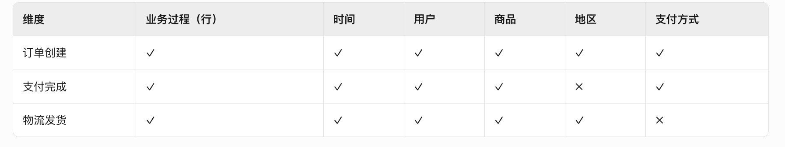
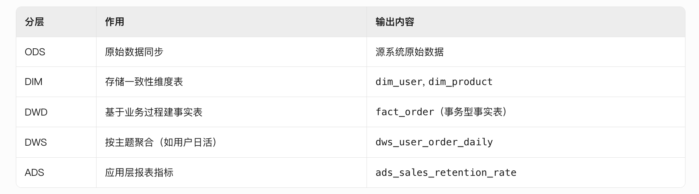

# 介绍体验数仓
先说业务，我对接的业务方是服务体验的运营，业务目标是降低客诉量，提高用户满意度
1.数据来源是c端用户、商家、骑手的客诉进线，包括APP内进线、电话语音
2.数仓分层是参照经典的五层架构ods，dwd、dwm,dws,app
核心维度是客诉问题分类，核心指标是nps满意度评分，人工服务量

客诉进线内容进行分类，拆成mece的问题树，这些问题就是核心维度
然后拆解出人工服务量，除上订单量，产出万订单人工服务量，这个是核心指标

然后分析各问题下的人工服务量，针对问题进行治理

# 介绍投放业务
首先对齐投放的概念，抖音上看到短剧的精彩片段，点击视频链接会跳转到app下载，或者打开短剧app
这个流程涉及哪几个角色呢？
1. 投放优化师，负责剪辑素材，在广告平台，比如抖音巨量、腾讯广点通、海外的Facebook等创建广告计划，上传素材，出价
2. 广告平台回传投放计划对应的广告消耗

数据是怎么做工的呢
1. 投放归因，将广告点击和用户购买会员的订单事件归因，实时计算投放计划的roi,及时通知优化师增加或者减少广告账户预算
2. 制定投放标准，根据同品类短剧的roi制定投放标准，比如女频、长篇、抖音平台的day1 roi应该达到30%，指导优化师投放
3. 计算优化师绩效，根据roi、充值金额计算优化师该分多少钱
4. 财务结算，短剧有第三方制作，需要根据播放量，给短剧制作者分成
5. 内容供给，分析各品类短剧的roi，播放量，留存率等调整内容引进策略

投放归因逻辑
- 数据源：广告点击事件，充值事件
- 处理逻辑：两个事件做union，source端遇到充值事件则生成一个watermark，按照uid做keyby，开窗，窗口大小30min
在窗口中排序，将充值事件归属到广告点击上

# 怎么衡量一个数仓建设的好不好
## 数据质量 (Data Quality) —— 生命线
如果数据不准，数仓做得再快也只是“更高效地提供错误信息”。
1. 数据一致性 (Consistency)：
    ○ 指标：指标口径偏差率。
    ○ 衡量：比如，财务报表的充值额、运营看板的充值额、投放后台的充值额，这三个数是否一致？如果各说各的话，数仓就是失败的。
2. 数据准确率 (Accuracy)：
    ○ 指标：源表与目标表数据差异率。
    ○ 衡量：定期进行 ODS 与 MySQL 业务库的抽样比对，差异应小于 0.1%（除非有明确的清洗规则）。
3. 数据完整性 (Completeness)：
    ○ 指标：记录缺失率、空值率（Null Rate）。
    ○ 衡量：核心字段（如 user_id, drama_id）是否出现非预期的空值。
4. 数据及时性 (Timeliness)：
    ○ 指标：SLA 达标率（数据产出延迟时长）。
    ○ 衡量：比如规定每天早上 8:00 必须出前一天的 ROI 看板，如果 90% 的天数都能准时产出，则说明及时性合格。
## 服务性能 (Performance) —— 体验感
数仓是给 BI 看板和分析师用的，性能直接影响决策速度。
1. 查询响应时间 (Query Latency)：
    ○ 指标：P95/P99 查询耗时。
    ○ 衡量：80% 的常用看板查询应在 3-5 秒内返回结果。如果一个 ROI 报表要跑 10 分钟，分析师就不想用了。
2. 作业执行时长 (ETL Runtime)：
    ○ 指标：凌晨批处理总时长。
    ○ 衡量：随着数据量增长，ETL 时间是否线性增长？是否有任务经常报错重跑导致延时？
3. 资源消耗比 (Resource Efficiency)：
    ○ 指标：单位数据存储/计算成本。
    ○ 衡量：有没有为了算一个简单的指标，动用了几百个节点的计算资源？
## 模型架构 (Architecture Health) —— 专业性
这决定了数仓的维护难度，也是你作为架构师功力的体现。
1. 分层引用规范度：
    ○ 指标：跨层依赖率（比如 ADS 直接连 ODS）。
    ○ 衡量：好的数仓应该是金字塔形。如果 ADS 层大量直接引用 ODS，说明 DWD/DWM/DWS 层没建好，复用性极差。
2. 数据复用率：
    ○ 指标：模型公共维度/事实的使用次数。
    ○ 衡量：如果同一个“剧集信息”被 20 个下游报表引用，说明模型复用度高；如果每个报表都自己去写 Join 逻辑，说明数仓价值低。
3. 指标冗余度：
    ○ 指标：同名不同义/同义不同名的指标数量。
    ○ 衡量：全公司是否只有“一个口径”的 ROI 定义？
4. 血缘完整性：
    ○ 指标：血缘覆盖率。
    ○ 衡量：当一个字段改动时，你能否立刻知道影响了哪些下游报表？

# 数仓为什么要分层
1. 维护成本降低。试想一个上千行的代码从头一点点理解，有问题需要修改时的维护成本是相当高的，而且很容易出错。
2. 隔离变化。试想一下，如果某天需要更换数据源A为C，只需要修改任务1的代码即可，对下游的可以做到屏蔽变化，无感知。
3. 增加了复用性，进而带来一致性的提升和开发效率的提升
4. 分层后可以持久化，可以用空间换时间，节省计算资源
5. 统一建设思路，方便分工

# 数仓分几层
1. 数据源层：ODS（Operational Data Store）
ODS 层，是最接近数据源中数据的一层，为了考虑后续可能需要追溯数据问题，因此对于这一层就不建议做过多的数据清洗工作，原封不动地接入原始数据即可，至于数据的去噪、去重、异常值处理等过程可以放在后面的 DWD 层来做。
2. 数据明细层：DWD（Data Warehouse Detail）
该层一般保持和 ODS 层一样的数据粒度，并且提供一定的数据质量保证。DWD 层要做的就是将数据清理、整合、规范化、脏数据、垃圾数据、规范不一致的、状态定义不一致的、命名不规范的数据都会被处理。
同时，为了提高数据明细层的易用性，该层会采用一些维度退化手法，将维度退化至事实表中，减少事实表和维表的关联。
3. 数据中间层：DWM（Data WareHouse Middle）
轻度聚合操作，生成一系列的中间表，提升公共指标的复用性，减少重复加工。
直观来讲，就是对通用的核心维度指标进行加工，算出通用指标。（比如对于订单状态表（商家信息表，券信息表，活动信息表），基本所有分析方向都会用到，补贴有商补、美补等，计算口径复杂，但是其他业务方向在用补贴数据时，可能只想用一个最终数值，比如总补贴金额，如果各业务方向都自己从dwd读取，自己做处理，非常麻烦且易出错）
如果业务相对简单，dws可以直接引用dwd
4. 数据服务层：DWS（Data WareHouse Servce）
主题宽表

# 什么是业务过程？（拒绝虚无，回归原子）
在 Kimball 的维度建模理论中，业务过程是不可拆分的行为事件。
- 它不是： “订单管理系统”、“营销模块”（这些是业务线/子系统）。
- 它是： “下单”、“支付”、“退款”、“确认收货”。

判断标准： 这个动作是否触发了数据的产生？如果一个动作发生了，数据库里多了一行记录或一个状态变了，这就是一个业务过程。

## 为什么要梳理业务过程？（不梳理的后果很严重）
- A. 确定数据粒度 (Grain) —— 防止计算翻车
    如果你不梳理业务过程，直接去接“订单表”，你会发现这张表里既有下单信息，又有支付信息。

    技术后果： 如果你在一个 SQL 里同时算“下单金额”和“支付金额”，由于有些单子没支付，你的过滤条件（WHERE status=...）会导致数据相互干扰。

    梳理意义： 明确“下单”是一个过程，“支付”是另一个过程。在 DWD 层分别构建下单事实表和支付事实表，确保每一行数据的粒度纯粹。

- B. 构建总线矩阵 (Bus Matrix) —— 解决数据孤岛
    数仓最怕“各说各话”。财务定义的“销售额”和运营定义的“销售额”对不上，通常是因为他们基于不同的业务过程。

    技术后果： 产生重复的 ETL 任务，Spark 集群里跑着大量逻辑相似但结果略有差异的 SQL，浪费计算资源。

    梳理意义： 通过业务过程梳理出一致性维度（如：同一套用户 ID、同一套商品 ID）。这样无论哪个部门要看数据，底层引用的都是同一套标准化事实表。

- C. 指标定义的唯一性 —— 避免 SQL 逻辑补丁
    如果你不清楚业务过程，你的 SQL 里会充斥着大量的 CASE WHEN status = 1 AND type = 2 ...。

    技术后果： 随着业务变化，这些硬编码逻辑会散落在数百个 SQL 任务中。一旦业务调整，调优和改bug的过程就是一场灾难。

    梳理意义： 将业务过程抽象化。业务过程变了，你只需要改对应的 DWD 层逻辑，上游应用无需感知。

# 什么是数据总线
只定义单个业务过程还不够，容易形成数据孤岛，还需要一致性维度将多个业务过程组织起来，通过共享“一致性维度”（Conformed Dimensions）连接多个业务过程，形成的架构就是数据总线
比如投放中的“素材上传”和“广告出价”这俩业务过程，就可以通过广告ID维度关联起来，合并到投放域的数据总线中

# 怎么进行数仓建模
1. 梳理业务过程
明确业务场景，梳理出业务过程
梳理核心指标（如客诉量、万订单人工服务量）和业务分析维度（客诉问题分类，用户现象、诉求分类等）

2. 梳理业务总线矩阵是​​一致性维度​​与​​业务过程​​的映射表，确保跨主题分析的数据一致性
业务总线矩阵是​​一致性维度​​与​​业务过程​​的映射表，确保跨主题分析的数据一致性

矩阵结构与价值​​

- ​列​​：一致性维度（全企业统一定义，如时间、用户）。
- 行​​：业务过程（每个过程独立建模）。
- ​交点​​：标记业务过程需关联的维度。​
- ​价值​​：避免烟囱式开发，支持跨业务分析（如“用户下单后物流时效”）。

<mark>构建五步法</mark>​​

    1. ​​划分数据域​​
        按业务相关性分组（如电商分为交易、用户、营销域），每个域包含多个业务过程。
    2. 提炼一致性维度​​
        归并冲突维度（如市场部“大区” vs 物流部“邮政编码” → 创建层级维度表dim_region）。
        退化冗余维度（如订单号直接存入事实表）。
    3.填充矩阵关系​​
        评审确认每个业务过程所需的维度，避免遗漏（如售后处理需关联用户、商品维度）。
    4. 解决维度冲突​​
        角色扮演​​：同一维度表在不同场景复用（如时间维度在订单中扮演“下单时间”和“支付时间”，通过视图别名实现）。
        ​缓慢变化维（SCD）​​：用户等级变化用Type 2拉链表存储历史版本。
    5.验证与迭代​​
        检查事实表至少关联3个维度，确保分析能力

3. 建模实施——从矩阵到分层架构​​
​​分层架构设计​​

# 什么是维度
维度在数据仓库中的作用是为事实数据提供上下文信息。不同类型的维度用于解决不同的业务场景和数据建模需求。常见的维度类型包括：
按照变与不变，可分为
- 标准维度：描述基本的业务数据，如时间、产品、客户等。
- 慢变维度：处理随时间变化的维度数据。

# 事实表分哪几类
- 事务型事实表：记录业务事件的详细数据，适合实时的事件跟踪和分析。比如订单明细表
- 周期型事实表：记录周期性数据的快照，适合按时间段进行汇总分析。比如财务月报
- 累积型事实表：记录某一时间点前的累积数据，适合查看累计结果。比如客户累计观看时长，消费金额
- 聚合型事实表：记录汇总的度量数据，适合提高查询性能，减少大规模数据查询的复杂度。比如各业务线客诉量

## 为什么要分这些类型的事实表？
1. 满足不同的业务需求：
每种类型的事实表都针对特定的业务需求。例如，事务型事实表适合详细跟踪每个事件，周期型事实表适合进行定期快照，累积型事实表适合累积计算，派生型事实表适合跟踪事件的发生情况，聚合型事实表适合提高查询性能。
2. 优化查询性能：
聚合型事实表和周期型事实表能够通过预先汇总和定期快照，减少对原始数据的查询负担，提高数据处理和查询的效率。
3. 数据管理与存储：
通过将不同类型的事实表分开管理，可以对数据进行有效的组织和存储。例如，累积型和聚合型事实表往往比事务型事实表更小，这样可以减少存储空间的使用，并提高查询效率。
4. 满足分析需求：
分类事实表使得不同类型的分析变得更加容易。例如，对于销售数据的深度分析，可能需要事务型事实表；而对于查看某个时间段的整体销售表现，则更适合周期型或聚合型事实表。
5. 历史数据的管理：
慢变维度和累积型事实表通常需要保留历史数据，通过专门的表类型，可以更好地处理这些数据的演变和变化。

## 维度设计要点
维度表构建需要注意两点
1. 一致性（Conformed Dimension）：确保跨业务线统一（如业务线的枚举值）
2. 缓慢变化维（SCD）处理：
    - Type1：覆盖历史值（适用于修正错误）
    - Type2：新增版本记录（常用，保留历史轨迹）
    - Type3：添加历史字段（有限历史存储）

## 退化维度
将高频访问的小维度（如订单号）直接嵌入事实表减少关联

# 怎么理解rdd
rdd全称resilent distributed datasets，翻译过来就是弹性分布式数据集
可以从三个特性上理解
1. partition rdd是分布式的，数据在物理上散落在不同计算节点的内存或是磁盘中
2. dependencies 在spark 中，任何一个rdd都不是凭空产生的，每个rdd都是基于某种计算逻辑从某个数据源转换而来。rdd dependencies属性封装了rdd所需的数据源，术语叫做父依赖（或父rdd）
3. compute方法则封装了从父rdd到当前rdd的转换逻辑
由dependencies和compute属性提供的容错能力，为spark分布式内存计算的稳定性提供了坚实基础，不同的rdd通过dependencies和compute串联起来

# dws层怎么应对频繁增加的维度
宽表设计的本质是通过冗余维度数据提升查询性能，但新增维度可能引发以下问题：
- 粒度变化
新增维度可能改变表的粒度（如从订单级细化到用户级别），需重新ETL全量数据。
- 下游影响
修改DWS层会触发所有下游表的变更，增加维护成本。
- 性能风险
宽表扩容可能导致查询性能下降，尤其当新增字段为高基数维度时。

解决方案为
1. 在ADS层扩展，避免修改DWS层
2. 采用星形、雪花形替代宽表，避免所有的维度都直接加到宽表上

dws怎么建设，怎么划分主题，是一个实体对应一个主题吗
一、DWS 的核心目标
1. 支持高效查询：通过预聚合和宽表设计，减少复杂查询的计算开销。
2. 提升数据复用性：通过主题域划分，确保数据能够被多个业务场景复用。
3. 降低数据冗余：通过合理的分层设计，避免数据重复存储。

# DWS 的设计原则
- 业务驱动：围绕业务需求设计主题域和指标。
- 轻度聚合：在 DWD（明细层）的基础上进行轻度聚合，保留必要的明细数据。
- 宽表设计：通过宽表减少关联查询，提升查询性能。
- 可扩展性：预留扩展字段，支持未来业务变化。

