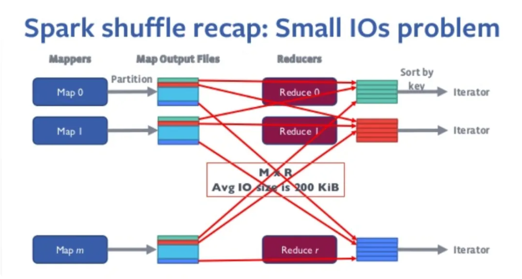
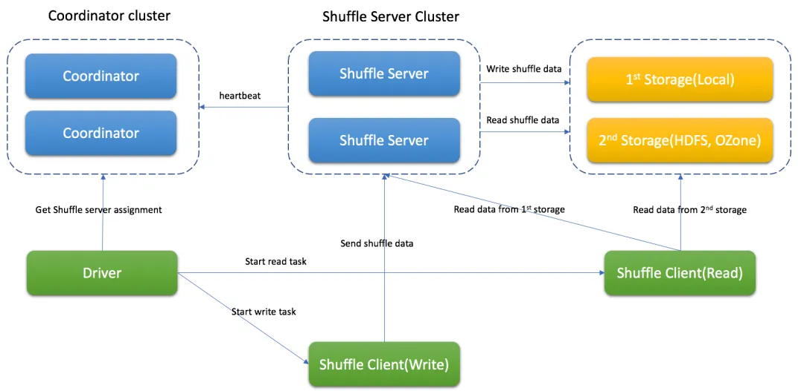
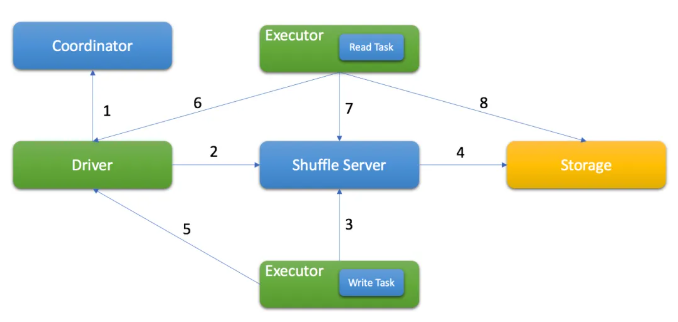

# spark3 shuffle fetch faild为什么更频繁

- ​资源需求提升​​，Spark 3 的 ​​AQE（自适应查询执行）​动态调整分区数，<mark>可能突发增加 Shuffle 数据量</mark>，若集群资源未预留缓冲，易触发 Fetch Failed。而传统 Spark 2 的分区数固定，资源规划更可控。

解决方式

初级
-  ​提升 Executor 内存​​
-  减少 Shuffle 数据量（列裁剪等）

高级
- 使用remote shuffle service

# remote shuffle service
对于超大规模的shuffle数据（T级别以上的shuffle量）的作业，原生spark shuffle有两点问题
- 容易内存溢出，spark dynamic allocation，动态分配资源，资源抢占会导致executor运行不稳定（两面性，动态分配资源提高资源使用率的同时，稳定性变差）----> 需要常驻的shuffle服务，更稳定
- 网络压力大，shuffle连接数为M*R个，容易将executor连接打满，导致失败

因此，引入外部shuffle service
Remote Shuffle Service的架构如下:

其中，各个组件的功能如下：

- Coordinator，基于心跳机制管理Shuffle Server，存储Shuffle Server的资源使用等元数据信息，还承担任务分配职责，根据Shuffle Server的负载，分配合适的Shuffle Server给Spark应用处理不同的Partition数据。

- Shuffle Server，主要负责接收Shuffle数据，聚合后再写入存储中，基于不同的存储方式，还能用来读取Shuffle数据(如LocalFile存储模式)。

- Shuffle Client，主要负责和Coordinator和Shuffle Server通讯，发送Shuffle数据的读写请求，保持应用和Coordinator的心跳等。

基于Firestorm的整体Shuffle流程如下:

1. Driver从Coordinator获取分配信息
2. Driver向Shuffle Server注册Shuffle信息
3. 基于分配信息，Executor将Shuffle数据以Block的形式发送到Shuffle Server
4. Shuffle Server将数据写入存储
5. 写任务结束后，Executor向Drive更新结果
6. 读任务从Driver侧获取成功的写Task信息
7. 读任务从Shuffle Server获得Shuffle元数据(如，所有blockId)
8. 基于存储模式，读任务从存储侧读取Shuffle数据

一句话概括，大部分etl任务，cpu不是瓶颈，磁盘和网络io（连接数）是瓶颈，因此，引入rss,将存算分离。

# external shuffle service
External Shuffle Service（ESS）是Spark中<mark>​​解耦计算与数据服务的核心组件</mark>​​​，通过独立进程管理Shuffle数据，提升作业稳定性与资源效率。以下从原理、部署、演进及优化四个维度全面解析：
## 核心原理与价值​​
​问题背景​​
​
- ​原生Spark痛点​​：<mark>Executor同时负责Task计算与Shuffle数据服务。当Executor因GC、负载过高或故障时，会导致下游无法读取Shuffle数据，引发FetchFailedException甚至作业失败。</mark>
- ​资源耦合​​：Executor退出时自动删除本地Shuffle数据，阻碍动态资源分配（Dynamic Resource Allocation, DRA）。

​​ESS工作机制​​
- ​独立进程​​：ESS作为常驻服务（如YARN的YarnShuffleService）运行在集群节点上，监听端口（默认7337）。
- ​数据注册​​：Executor启动时向ESS注册Shuffle文件位置（RegisterExecutor消息），包含目录结构、ShuffleManager类型等元数据。
- ​数据服务​​：Reduce Task通过OpenBlocks请求从ESS获取数据，ESS根据索引文件定位数据块并返回。

​​核心价值​​
- 可靠性提升​​：Executor故障后，ESS仍可提供其生成的Shuffle数据。
- ​支持动态资源分配​​：释放闲置Executor时保留Shuffle数据，实现资源弹性伸缩。
- 减轻Executor压力​​：避免Executor因服务Shuffle请求导致GC停顿或网络阻塞

# spark两种算子的区别

| 维度 | transformation | action |
| --- | --- | --- |
| 执行时机 | 惰性执行（仅记录操作到dag,不立即计算） | 立即执行（触发dag提交到集群计算） |
| 返回值 | 返回新的rdd或dataframe,dataset | 返回非分布式数据（如数值、文件路径） |

常见算子
1. Transformation 算子（延迟执行）​​
    - ​​Value 型​​（单列操作）
        - map(func)：逐元素转换（rdd.map(x => x*2)）
        - filter(func)：过滤满足条件的元素（rdd.filter(_ > 10)）
        - flatMap(func)：扁平化嵌套结构（text.flatMap(_.split(" "))）
    - ​Key-Value 型​​（键值对操作）：
        - reduceByKey(func)：分区内预聚合（pairs.reduceByKey(_ + _)）
        - join(otherRDD)：内连接两个 RDD（rdd1.join(rdd2)）
        - groupByKey()：按 Key 分组（易导致数据倾斜，优先用 reduceByKey）
    - ​结构优化型​​：
        - repartition(numPartitions)：调整分区数（触发 Shuffle）
        - coalesce(numPartitions)：合并分区（避免 Shuffle）
2. Action 算子（立即执行）​​
    - 结果收集型​​：
        - collect()：​​慎用​​！全量数据拉取到 Driver，易 OOM（替代方案：take(n)）
        - count()：统计元素总数
    - 聚合计算型​​：
        - reduce(func)：全局聚合（rdd.reduce(_ + _)）
        - countByKey()：统计每个 Key 的出现次数
    - 数据输出型​​：
        - saveAsTextFile(path)：保存结果到 HDFS/本地
        - foreach(func)：遍历元素（如写入数据库）

# 宽依赖和窄依赖
宽窄依赖是spark生成物理执行计划时的一个概念，是划分stage的依据
- 窄：父分区仅被一个子分区依赖，可合并为同一stage
- 宽：父分区被多个子分区依赖，需要shuffle并划分新stage

### 为什么要划分宽窄?
可以根据不同依赖进行优化
- 窄依赖可以流水线化，连续的窄依赖可以合并到同一task，避免中间结果落盘
- 宽依赖shuffle优化，合并小文件，排序索引

# DAG生成过程
- 1. 构建逻辑计划
- 2. 逻辑计划优化
    - 谓词下推和列裁剪
- 3. 生成物理计划
    - 确定具体的执行策略，排序算法
    - 确定宽依赖和窄依赖
- 4. stage划分与调度
    - 从action反向遍历，遇到宽依赖则切分stage
    - 任务生成，每个stage划分为多个task（task数=分区数），由TaskScheduler分发到Executor执行
