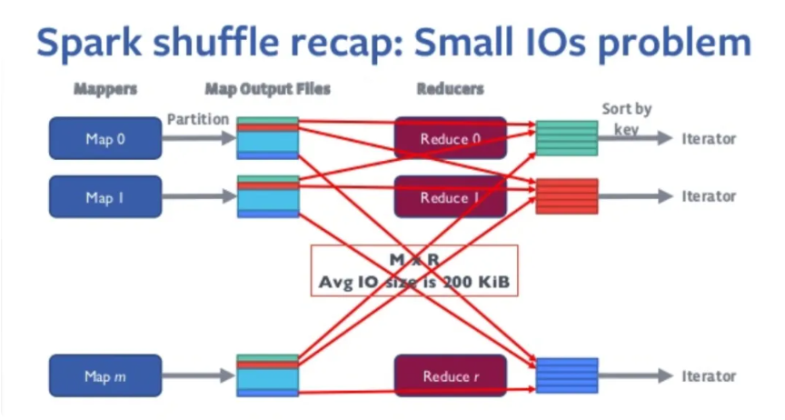
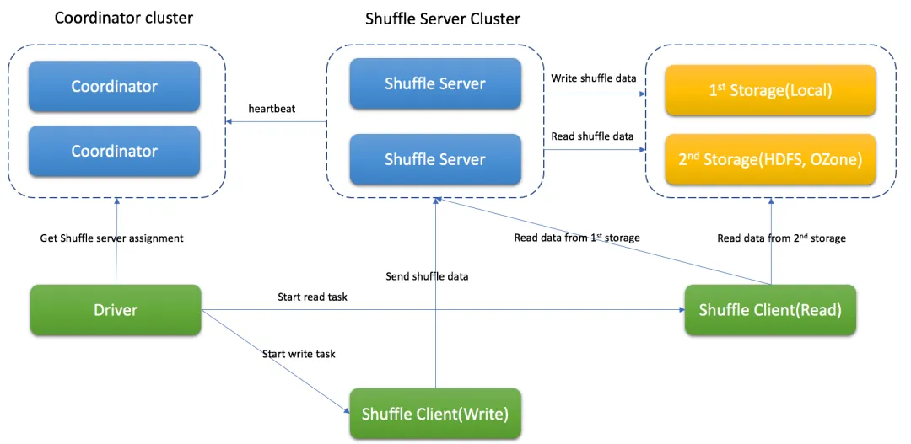
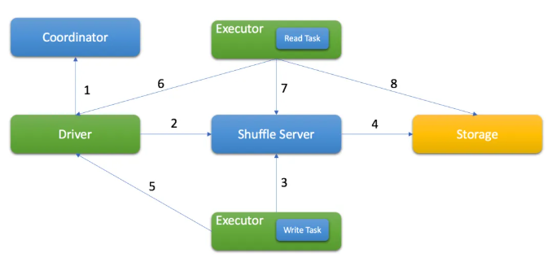
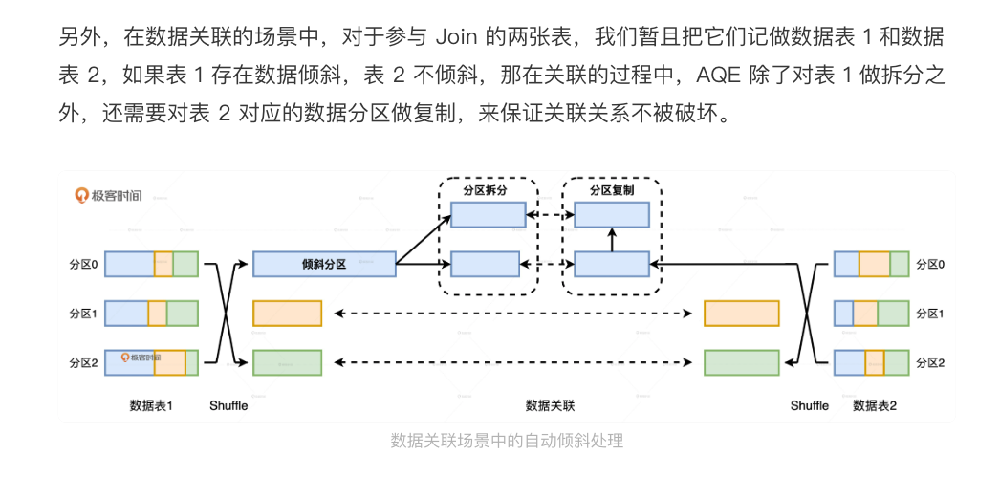

# rdd怎么理解
rdd全称弹性分布式数据集（resilient distributed dataset）,其有4大特性

# spark3 shuffle fetch faild为什么更频繁

- ​资源需求提升​​，Spark 3 的 ​​AQE（自适应查询执行）​动态调整分区数，<mark>可能突发增加 Shuffle 数据量</mark>，若集群资源未预留缓冲，易触发 Fetch Failed。而传统 Spark 2 的分区数固定，资源规划更可控。

解决方式

初级
-  ​提升 Executor 内存​​
-  减少 Shuffle 数据量（列裁剪等）

高级
- 使用remote shuffle service

# remote shuffle service
对于超大规模的shuffle数据（T级别以上的shuffle量）的作业，原生spark shuffle有两点问题
- 容易内存溢出，spark dynamic allocation，动态分配资源，资源抢占会导致executor运行不稳定（两面性，动态分配资源提高资源使用率的同时，稳定性变差）----> 需要常驻的shuffle服务，更稳定
- 网络压力大，shuffle连接数为M*R个，容易将executor连接打满，导致失败




因此，引入外部shuffle service
Remote Shuffle Service的架构如下:


其中，各个组件的功能如下：

- Coordinator，基于心跳机制管理Shuffle Server，存储Shuffle Server的资源使用等元数据信息，还承担任务分配职责，根据Shuffle Server的负载，分配合适的Shuffle Server给Spark应用处理不同的Partition数据。

- Shuffle Server，主要负责接收Shuffle数据，聚合后再写入存储中，基于不同的存储方式，还能用来读取Shuffle数据(如LocalFile存储模式)。

- Shuffle Client，主要负责和Coordinator和Shuffle Server通讯，发送Shuffle数据的读写请求，保持应用和Coordinator的心跳等。

基于Firestorm的整体Shuffle流程如下:


1. Driver从Coordinator获取分配信息
2. Driver向Shuffle Server注册Shuffle信息
3. 基于分配信息，Executor将Shuffle数据以Block的形式发送到Shuffle Server
4. Shuffle Server将数据写入存储
5. 写任务结束后，Executor向Drive更新结果
6. 读任务从Driver侧获取成功的写Task信息
7. 读任务从Shuffle Server获得Shuffle元数据(如，所有blockId)
8. 基于存储模式，读任务从存储侧读取Shuffle数据

一句话概括，大部分etl任务，cpu不是瓶颈，磁盘和网络io（连接数）是瓶颈，因此，引入rss,将存算分离。

# external shuffle service
External Shuffle Service（ESS）是Spark中<mark>​​解耦计算与数据服务的核心组件</mark>​​​，通过独立进程管理Shuffle数据，提升作业稳定性与资源效率。以下从原理、部署、演进及优化四个维度全面解析：
## 核心原理与价值​​
​问题背景​​
​
- ​原生Spark痛点​​：<mark>Executor同时负责Task计算与Shuffle数据服务。当Executor因GC、负载过高或故障时，会导致下游无法读取Shuffle数据，引发FetchFailedException甚至作业失败。</mark>
- ​资源耦合​​：Executor退出时自动删除本地Shuffle数据，阻碍动态资源分配（Dynamic Resource Allocation, DRA）。

​​ESS工作机制​​
- ​独立进程​​：ESS作为常驻服务（如YARN的YarnShuffleService）运行在集群节点上，监听端口（默认7337）。
- ​数据注册​​：Executor启动时向ESS注册Shuffle文件位置（RegisterExecutor消息），包含目录结构、ShuffleManager类型等元数据。
- ​数据服务​​：Reduce Task通过OpenBlocks请求从ESS获取数据，ESS根据索引文件定位数据块并返回。

​​核心价值​​
- 可靠性提升​​：Executor故障后，ESS仍可提供其生成的Shuffle数据。
- ​支持动态资源分配​​：释放闲置Executor时保留Shuffle数据，实现资源弹性伸缩。
- 减轻Executor压力​​：避免Executor因服务Shuffle请求导致GC停顿或网络阻塞

# spark两种算子的区别

| 维度 | transformation | action |
| --- | --- | --- |
| 执行时机 | 惰性执行（仅记录操作到dag,不立即计算） | 立即执行（触发dag提交到集群计算） |
| 返回值 | 返回新的rdd或dataframe,dataset | 返回非分布式数据（如数值、文件路径） |

常见算子
1. Transformation 算子（延迟执行）​​
    - ​​Value 型​​（单列操作）
        - map(func)：逐元素转换（rdd.map(x => x*2)）
        - filter(func)：过滤满足条件的元素（rdd.filter(_ > 10)）
        - flatMap(func)：扁平化嵌套结构（text.flatMap(_.split(" "))）
    - ​Key-Value 型​​（键值对操作）：
        - reduceByKey(func)：分区内预聚合（pairs.reduceByKey(_ + _)）
        - join(otherRDD)：内连接两个 RDD（rdd1.join(rdd2)）
        - groupByKey()：按 Key 分组（易导致数据倾斜，优先用 reduceByKey）
    - ​结构优化型​​：
        - repartition(numPartitions)：调整分区数（触发 Shuffle）
        - coalesce(numPartitions)：合并分区（避免 Shuffle）
2. Action 算子（立即执行）​​
    - 结果收集型​​：
        - collect()：​​慎用​​！全量数据拉取到 Driver，易 OOM（替代方案：take(n)）
        - count()：统计元素总数
    - 聚合计算型​​：
        - reduce(func)：全局聚合（rdd.reduce(_ + _)）
        - countByKey()：统计每个 Key 的出现次数
    - 数据输出型​​：
        - saveAsTextFile(path)：保存结果到 HDFS/本地
        - foreach(func)：遍历元素（如写入数据库）

# 宽依赖和窄依赖
宽窄依赖是spark生成物理执行计划时的一个概念，是划分stage的依据
- 窄：父分区仅被一个子分区依赖，可合并为同一stage
- 宽：父分区被多个子分区依赖，需要shuffle并划分新stage

### 为什么要划分宽窄?
可以根据不同依赖进行优化
- 窄依赖可以流水线化，连续的窄依赖可以合并到同一task，避免中间结果落盘
- 宽依赖shuffle优化，合并小文件，排序索引

# DAG生成过程
1. 构建逻辑计划
2. 逻辑计划优化
    - 谓词下推和列裁剪
3. 生成物理计划
    - 确定具体的执行策略，排序算法
    - 确定宽依赖和窄依赖
4. stage划分与调度
    - 从action反向遍历，遇到宽依赖则切分stage
    - 任务生成，每个stage划分为多个task（task数=分区数），由TaskScheduler分发到Executor执行

# spark AQE根据哪些文件做优化
根据<mark>Shuffle Map阶段输出的中间文件</mark>。我们知道，每个 Map Task 都会输出以 data 为后缀的数据文件，还有以 index 为结尾的索引文件，这些文件统称为中间文件。每个 data 文件的大小、空文件数量与占比、每个 Reduce Task 对应的分区大小，所有这些基于中间文件的统计值构成了 AQE 进行优化的信息来源。

# spark AQE代码解析
AQE 既定的规则和策略主要有4个，分为1个逻辑优化规则和3个物理优化策略。我把这些规则与策略，和相应的 AQE 特性，以及每个特性仰仗的统计信息，都汇总到了如下的表格中。
| 优化类型 | 规则与策略 | AQE特性 | 统计信息 |
| --- | --- | --- | --- |
| 逻辑计划 | DemoteBroadcastHashJoin | join策略调整 | map阶段中间文件 |
| 物理计划 | OptimizeLocalShuffleReader | join策略调整 | map阶段中间文件 |
| 物理计划 | CoalesceShufflePartitions | 自动分区合并 | reduce task分区大小 |
| 物理计划 | OptimizedSkewedJoin | 自动倾斜处理 | reduce task分区大小 |

# spark AQE做了哪些优化
1. 动态分区合并
Shuffle Map 阶段结束后，AQE 统计输出数据量，自动合并相邻小分区，目标分区大小由 spark.sql.adaptive.advisoryPartitionSizeInBytes（默认 64MB）控制
2. 动态join策略优化
    - 广播join自动转化  
        运行时精确统计表大小，若小表尺寸低于广播阈值（默认 10MB），自动将 Sort Merge Join 转为 Broadcast Hash Join
    - 本地shuffle读取优化   
        Broadcast Join 转换后，Reduce Task 直接读取本地节点的 Shuffle 中间文件，避免网络传输    
        参数：spark.sql.adaptive.localShuffleReader.enabled=true
3. 数据倾斜自动优化  
    spark3 检测到分区大小 > 中位数 * spark.sql.adaptive.skewJoin.skewedPartitionFactor(默认5) 且 > spark.sql.adaptive.skewJoin.skewedPartitionThreadholdInBytes(默认256m)
    处理流程
    1. 切块，则将大分区按目标大小（advisoryPartitionSizeInBytes）切块
    2. 复制，关联表的对应分区复制到多个task,保持join的完整性    
        
4. 动态分区裁剪（Dynamic Partition Pruning, DPP）
    运行时根据维表过滤结果，跳过事实表无关分区，减少 I/O。

# spark2升级spark3会遇到哪些问题
一句话总结：大部分问题不是“代码跑不起来”，而是“结果口径变了、性能模型变了、依赖生态变了”。

## 1. 依赖和运行环境兼容问题
- Scala版本变化，很多 Spark 2 项目是 `2.11`，Spark 3 常见是 `2.12`，历史 jar 包如果没重编译，容易出现 `NoSuchMethodError`、`ClassNotFoundException`
- JDK 版本差异，部分老项目只在 JDK8 下验证过，升级后如果同时切到更高版本 JDK，反射、时间函数、老连接器行为都可能变化
- 周边组件版本要一起看：`hive-metastore`、`hadoop client`、`spark-sql-kafka`、`iceberg/hudi/paimon`、各类 JDBC 驱动，不是只升 Spark 主版本就够了
- 典型现象：本地编译通过，集群提交报错；或者 driver 能启动，executor 运行时报类冲突

## 2. SQL 结果不一致问题
这是离线数仓升级里最容易踩坑的一类。

| 现象 | 常见原因 | 处理方式 |
| --- | --- | --- |
| 日期字符串以前能转，升级后报错或变成 null | Spark 3 时间解析更严格 | 优先修正脏数据或规范格式；过渡期可看 `spark.sql.legacy.timeParserPolicy=LEGACY` |
| 历史日期读出来偏移几天 | Spark 2/3 在 `Parquet/ORC/Avro` 上的日期历法重基线策略不同 | 排查 `datetimeRebaseModeInRead/Write` 相关参数 |
| 插入表时报类型转换异常 | Spark 3 对类型赋值、cast 更严格 | 排查字段类型，必要时显式 cast；关注 `spark.sql.storeAssignmentPolicy` |
| 原来“能跑但不严谨”的 SQL 升级后直接失败 | ANSI 行为更严格，除零、溢出、非法转换不再默默吞掉 | 明确是保守兼容还是主动收敛脏数据，必要时调整 `spark.sql.ansi.enabled` |
| 同一份 SQL 结果条数变了 | 解析器、空值处理、隐式类型转换、join 选择变化 | 对关键 SQL 做结果集 diff，不要只看任务成功 |

## 3. 时间和时区问题
- 时间字段是升级里最容易“看起来没报错，结果已经错了”的地方
- 重点排查三类字段：`date`、`timestamp`、字符串时间列
- 重点核对三类场景：分区字段、窗口统计、跨天口径
- 如果任务涉及 `from_unixtime`、`unix_timestamp`、`to_date`、`to_timestamp`、`date_format`，都建议抽样回归
- 如果链路里有 Hive 表、Parquet 老数据、下游 Doris/ClickHouse/ES，同样要核对时区一致性

## 4. 执行计划和性能变化
- Spark 3 的优化器更积极，同一条 SQL 可能生成完全不同的物理计划
- 很多团队升级后最直观的感受不是“变快”，而是“有些任务快了，有些任务反而抖动更大”

常见变化点：
- AQE 介入后，join 策略、reduce 分区数、倾斜处理都可能在运行时变化
- 广播 join 更容易触发，小表估计更准确，但也可能把 driver / executor 内存打满
- 本地 shuffle reader、生效后的 coalesce、skew join 拆分，会让 task 数和 stage 行为跟 Spark 2 明显不同
- 原先靠固定 `spark.sql.shuffle.partitions` 调优的经验，在 Spark 3 上未必还成立

典型问题：
- task 数量突然变少，单 task 变重，尾部更慢
- task 数量突然变多，调度开销增大
- 某些 join 从 sort merge 变成 broadcast 之后，结果快了但 executor 更容易 OOM
- 数据倾斜场景下，部分 SQL 明显变快，但极端场景依然会出现长尾

## 5. shuffle 稳定性问题
- 这是升级后经常和“性能问题”绑在一起出现的
- Spark 3 本身没有必然让 shuffle 更差，但 AQE、动态分区、自适应 join 会放大 shuffle 行为变化
- 如果集群本来就有以下问题，升级后更容易暴露：
  - executor 内存偏小
  - ESS 不稳定
  - dynamic allocation 抢占频繁
  - 单机磁盘 / 网络已经接近瓶颈

典型现象：
- `FetchFailedException`
- shuffle 读写时间突增
- executor 丢失后整段 stage 反复重试
- 原来 Spark 2 勉强能跑过的大宽表 join，在 Spark 3 下更容易出现波动

处理思路：
- 先看 AQE 是否介入，再看是否是 join 策略变了
- 对超大 shuffle 任务重新评估 `executor memory`、`memoryOverhead`、`shuffle partitions`
- 动态资源分配场景核对 `spark.shuffle.service.enabled`
- 如果业务规模已经到 T 级 shuffle，单靠调参数通常不够，要考虑 ESS/RSS

## 6. UDF / 自定义函数问题
- 很多老项目里有大量 UDF、UDAF、日期工具类、老版 `SimpleDateFormat`
- 升级后常见问题不是编译报错，而是行为跟之前不一致
- 特别是以下场景要重点回归：
  - 时间解析 UDF
  - JSON 解析 UDF
  - null 值容错逻辑
  - Decimal 计算
  - 自定义聚合函数

## 7. 数据源和表格式问题
- 读取 Hive 表时，catalog、分区发现、serde 兼容都要重新验证
- 读写 `Parquet/ORC` 时，除了日期重基线，还要看 schema 演进是否正常
- 如果项目顺手引入了 `Iceberg/Hudi/Paimon`，要检查对应 connector 是否明确支持当前 Spark 3 小版本
- 很多升级失败不是 Spark 核心问题，而是表格式 jar 包和 Spark 小版本不匹配

## 8. 常见配置回退点
这些参数不是让你长期依赖，而是升级排障时很好用：

- `spark.sql.legacy.timeParserPolicy`
- `spark.sql.ansi.enabled`
- `spark.sql.storeAssignmentPolicy`
- `spark.sql.parquet.datetimeRebaseModeInRead`
- `spark.sql.parquet.datetimeRebaseModeInWrite`
- `spark.sql.orc.datetimeRebaseModeInRead`
- `spark.sql.orc.datetimeRebaseModeInWrite`
- `spark.sql.adaptive.enabled`
- `spark.sql.adaptive.skewJoin.enabled`
- `spark.sql.adaptive.localShuffleReader.enabled`
- `spark.sql.autoBroadcastJoinThreshold`
- `spark.sql.shuffle.partitions`

排障原则：
- 先用这些参数快速定位“是语义变了，还是性能变了”
- 确认根因后，优先修 SQL、修数据、修模型，不要长期靠 legacy 参数兜底

## 9. 推荐升级步骤
1. 先做依赖盘点，确认 Scala / JDK / Hive / Hadoop / connector 版本矩阵
2. 选一批核心离线任务做双跑，对比行数、主键数、金额、时间口径等关键指标
3. 对慢 SQL 抓 `explain formatted`，直接比较 Spark 2 / 3 的物理计划差异
4. 对高风险任务单独验证：大宽表 join、窗口聚合、动态分区写入、历史分区回刷
5. 保留一套“兼容参数模板”，用于快速切换 legacy/ansi/AQE 开关定位问题
6. 最后再做统一性能调优，不要在结果都没对齐前就急着调参数

## 10. 面试里怎么回答更像做过升级
不要只说“语法兼容、依赖升级、测试一下”。

更好的回答方式：
- 先说三类问题：依赖兼容、结果口径、性能稳定性
- 再举两个具体例子：时间解析变严格、AQE 导致 join/shuffle 行为变化
- 最后补落地动作：双跑比对、关键参数回退、Explain 对比、灰度上线

这样回答，面试官会更容易判断你是真的做过 Spark2 -> Spark3 升级，而不是只看过资料。


# 广播表数据膨胀链路

1. Parquet 文件 (列式压缩)
    600MB
      ↓ 读取反序列化（3~5x 膨胀）
2. JVM 堆内对象
    1.8GB ~ 3GB
      ↓ Kryo/Java 序列化（约 1~2x）
3. Broadcast 序列化字节块
    1.2GB ~ 2GB
      ↓ 发送到每个 Executor 并存储
4. 每个 Executor BlockManager (Storage Memory)
    1.2GB ~ 2GB


## Driver 内存需求
Driver 需要同时持有：
  反序列化数据:  ~2GB
+ 序列化字节块:  ~1.5GB
+ Driver 自身开销: ~1GB
─────────────────────
最低:  4g
建议:  8g

`spark.driver.memory = 8g`


## Executor 内存需求
Broadcast 存储在 BlockManager 的 Storage Memory 中：
Storage Memory = executor.memory × memory.fraction × storageFraction
              = executor.memory × 0.6 × 0.5
              = executor.memory × 30%

要存下 1.5GB 广播数据：
executor.memory × 30% ≥ 1.5GB
executor.memory ≥ 5GB

再加执行内存（Join 计算）+ 堆外开销（memoryOverhead ~10%）：
建议: 12g ~ 16g per executor


配置建议
```sql
-- 调大广播阈值允许 600MB 表走广播
SET spark.sql.autoBroadcastJoinThreshold = 1073741824; -- 1GB

-- Driver
spark.driver.memory = 8g
spark.driver.maxResultSize = 4g

-- Executor  
spark.executor.memory = 12g
spark.executor.memoryOverhead = 2g  -- 堆外，防 OOM

-- 可选：用 Kyro 减少序列化体积（降低 30%~50%）
spark.serializer = org.apache.spark.serializer.KryoSerializer
```


## 风险点
| 场景 | 风险 | 说明 |
| :--- | :----: | ---: |
| 多个广播表同时存在 | Storage Memory 叠加，容易 OOM | Executor 并发 Task 多 |
| 宽表列多（字符串列） | 膨胀倍数可能超过 5x | GC 压力 |
| 大对象频繁 Full GC | 建议开 G1GC | -XX:+UseG1GC |

结论：600MB Parquet 表广播，Driver 建议 8g，Executor 建议 12~16g。 若集群内存紧张，优先考虑之前讨论的 Bucket Join 方案。

# 广播在spark2和spark3的不同策略
广播在Spark 2 和 Spark 3 的核心差别是：

- Spark 2 以“静态决策”为主
- Spark 3 变成了“静态决策 + 运行时自适应”。

具体看：
- Spark 2 的广播策略
主要依据编译期统计信息和 spark.sql.autoBroadcastJoinThreshold 决定是否自动广播，这个阈值默认是 10MB。
用户基本只能显式给 BROADCAST / MAPJOIN hint。
一旦物理计划定下来，通常就是定死的；如果前期统计信息不准，Spark 2 不会在执行中把 SortMergeJoin 再改成 BroadcastHashJoin。
- Spark 3 的广播策略
保留了 Spark 2 的自动广播阈值和 BROADCAST hint。
Spark 3.2 开始，AQE 默认开启，所以很多“本来不会广播”的 join，在运行时可能被改成广播 join。
