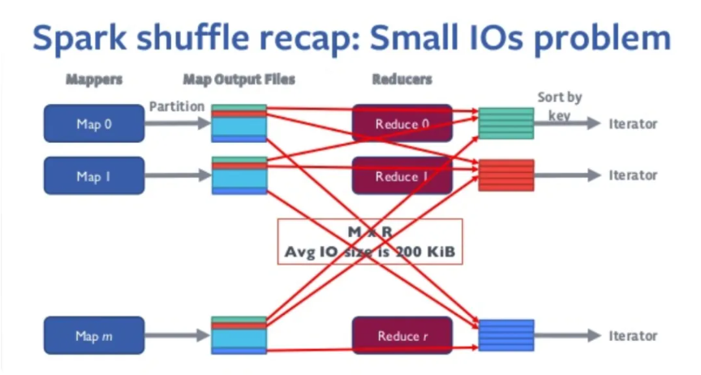
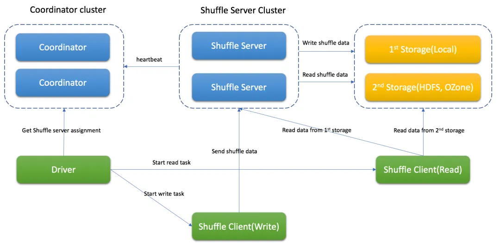
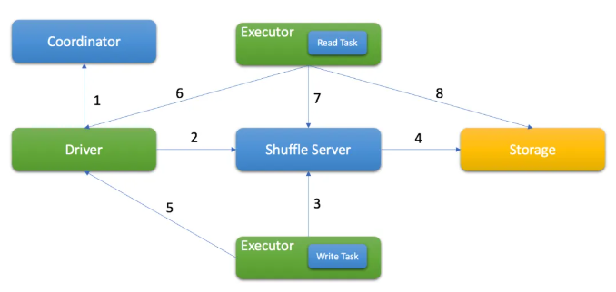

# spark3 shuffle fetch faild为什么更频繁

- ​资源需求提升​​，Spark 3 的 ​​AQE（自适应查询执行）​动态调整分区数，<mark>可能突发增加 Shuffle 数据量</mark>，若集群资源未预留缓冲，易触发 Fetch Failed。而传统 Spark 2 的分区数固定，资源规划更可控。

解决方式

初级
-  ​提升 Executor 内存​​
-  减少 Shuffle 数据量（列裁剪等）

高级
- 使用remote shuffle service

# remote shuffle service
对于超大规模的shuffle数据（T级别以上的shuffle量）的作业，原生spark shuffle有两点问题
- 容易内存溢出，spark dynamic allocation，动态分配资源，资源抢占会导致executor运行不稳定（两面性，动态分配资源提高资源使用率的同时，稳定性变差）----> 需要常驻的shuffle服务，更稳定
- 网络压力大，shuffle连接数为M*R个，容易将executor连接打满，导致失败

因此，引入外部shuffle service
Remote Shuffle Service的架构如下:

其中，各个组件的功能如下：

- Coordinator，基于心跳机制管理Shuffle Server，存储Shuffle Server的资源使用等元数据信息，还承担任务分配职责，根据Shuffle Server的负载，分配合适的Shuffle Server给Spark应用处理不同的Partition数据。

- Shuffle Server，主要负责接收Shuffle数据，聚合后再写入存储中，基于不同的存储方式，还能用来读取Shuffle数据(如LocalFile存储模式)。

- Shuffle Client，主要负责和Coordinator和Shuffle Server通讯，发送Shuffle数据的读写请求，保持应用和Coordinator的心跳等。

基于Firestorm的整体Shuffle流程如下:

1. Driver从Coordinator获取分配信息
2. Driver向Shuffle Server注册Shuffle信息
3. 基于分配信息，Executor将Shuffle数据以Block的形式发送到Shuffle Server
4. Shuffle Server将数据写入存储
5. 写任务结束后，Executor向Drive更新结果
6. 读任务从Driver侧获取成功的写Task信息
7. 读任务从Shuffle Server获得Shuffle元数据(如，所有blockId)
8. 基于存储模式，读任务从存储侧读取Shuffle数据

一句话概括，大部分etl任务，cpu不是瓶颈，磁盘和网络io（连接数）是瓶颈，因此，引入rss,将存算分离。

